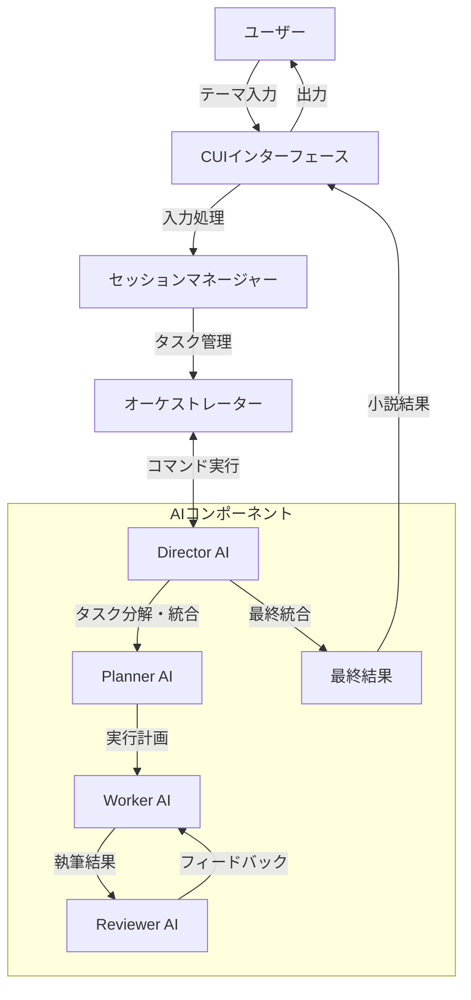
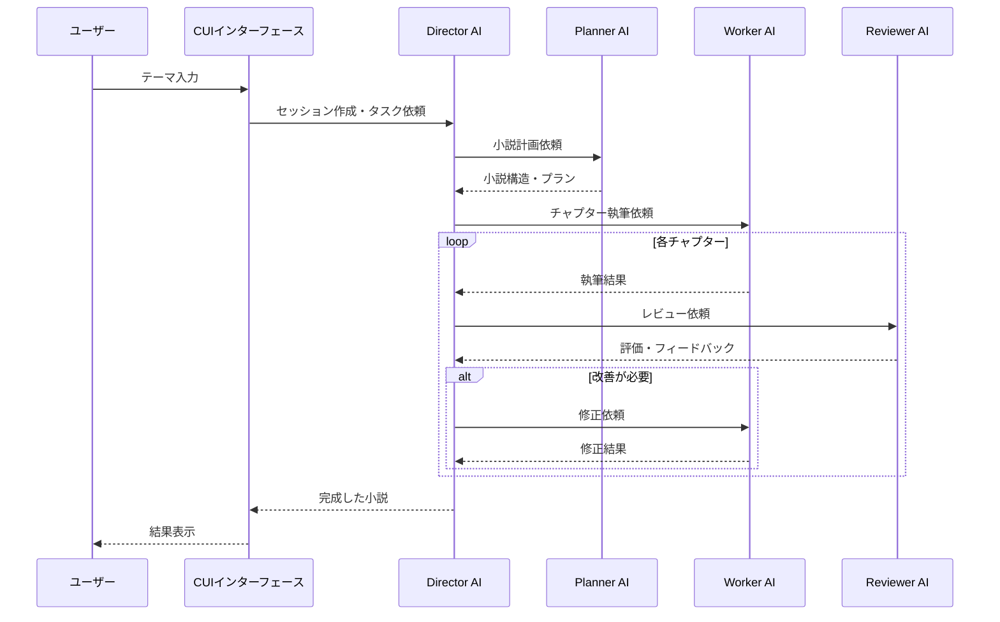
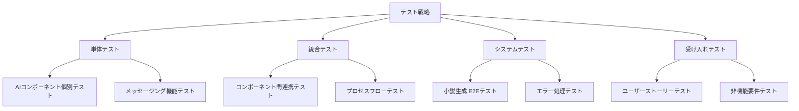

# AI小説生成オーケストレーションシステム - プロジェクト計画書

## 1. プロジェクト概要

### 1.1 背景と目的

本プロジェクトは、単一のAIではなく複数のAIコンポーネントをオーケストレーションすることで、単純なテーマ入力から長編小説を生成するシステムの構築を目指しています。従来の単一LLMアプローチでは、長文生成の限界や一貫性の維持が困難という課題がありましたが、各専門AIが連携することでこれらの課題を解決します。

### 1.2 主な機能

- **CUIベースの小説生成システム**: コマンドラインから簡単に小説生成を依頼できるインターフェース
- **複数AIのオーケストレーション**: Director、Planner、Worker、Reviewerの4つの専門AIコンポーネントの連携
- **長編小説生成能力**: 一貫性を保ちながら長文の小説を生成
- **フィードバックと改善サイクル**: AIによる自己レビューと改善の仕組み
- **将来的な検索拡張**: 後続フェーズでの検索機能の追加により、事実情報を活用した小説生成

### 1.3 ターゲットユーザー

- 小説創作に興味があるが、執筆スキルや時間が不足している人
- AIを活用したコンテンツ生成に関心がある人
- 物語のアイデアはあるが、形にするのが難しいと感じている人

## 2. システムアーキテクチャ

### 2.1 全体構成



### 2.2 コンポーネント詳細

#### Director AI

- 役割: 全体のプロセス制御と結果の統合
- 主要機能:
  - タスク分解の監督
  - サブタスク実行の調整
  - 執筆結果の統合
  - 全体的な一貫性の確保

#### Planner AI

- 役割: 小説構造の計画立案
- 主要機能:
  - プロット設計
  - キャラクター設定
  - 世界観構築
  - チャプター分割

#### Worker AI

- 役割: 実際の小説執筆
- 主要機能:
  - プランに基づく章ごとの執筆
  - 描写の詳細化
  - ダイアログの作成
  - ナラティブの構築

#### Reviewer AI

- 役割: 品質評価とフィードバック
- 主要機能:
  - 文章の一貫性チェック
  - 物語の魅力評価
  - 具体的な改善提案
  - 文法や表現のレビュー

### 2.3 データフロー



## 3. 実装計画

### 3.1 フェーズ分け

#### フェーズ1: 基本システム構築（現在）

- 基本的なオーケストレーションの仕組み構築
- 4つのAIコンポーネントの実装
- CUIインターフェースの基本機能
- 単一セッションでの小説生成

#### フェーズ2: 機能拡張

- 検索機能の追加による事実情報の活用
- 複数セッションの管理機能
- ユーザーフィードバックの取り込み
- 生成結果のエクスポート機能

#### フェーズ3: 高度化・最適化

- パフォーマンス最適化
- 複数ジャンル対応の強化
- APIインターフェースの提供
- ウェブインターフェースの追加（オプション）

### 3.2 技術スタック

- **言語**: Python 3.12+
- **依存ライブラリ**:
  - agno: AIフレームワーク
  - ollama: ローカルLLM対応
  - fastapi: API機能（将来拡張用）
  - pydantic: データバリデーション

### 3.3 開発環境

- **パッケージ管理**: Poetry
- **開発フロー**: Gitベースの変更管理
- **テスト**: pytest

## 4. 実装詳細

### 4.1 ファイル構造

```
.
├── orchestration/    # メインのオーケストレーションロジック
│   ├── __init__.py
│   ├── agno_client.py          # Agnoフレームワーク連携
│   ├── commands.py             # コマンド実装
│   ├── config.py               # 設定管理
│   ├── exceptions.py           # 例外定義
│   ├── factory.py              # AIコンポーネント生成
│   ├── main.py                 # メインエントリーポイント
│   ├── types.py                # 型定義
│   ├── core/                   # コア機能
│   │   ├── __init__.py
│   │   └── session.py          # セッション管理
│   ├── components/             # AIコンポーネント
│   │   ├── __init__.py
│   │   ├── base.py             # 基底クラス
│   │   ├── director.py         # Director実装
│   │   ├── planner.py          # Planner実装
│   │   ├── worker.py           # Worker実装
│   │   └── reviewer.py         # Reviewer実装
│   ├── llm/                    # LLM管理
│   │   ├── __init__.py
│   │   └── llm_manager.py      # LLM操作
│   ├── prompts/                # プロンプトテンプレート
│   │   ├── director/
│   │   ├── planner/
│   │   ├── worker/
│   │   └── reviewer/
│   ├── utils/                  # ユーティリティ
│   │   ├── __init__.py
│   │   ├── common.py           # 共通関数
│   │   └── debugger.py         # デバッグ支援
├── cui/                        # CUIインターフェース
│   ├── __init__.py
│   ├── novel_writer.py         # 小説生成CUI
│   └── run_novel_writer.py     # 実行スクリプト
├── schemas/                    # データスキーマ
│   └── __init__.py
├── tests/                      # テストコード
├── .gitignore
├── pyproject.toml              # 依存関係定義
├── pytest.ini                  # テスト設定
└── README.md                   # プロジェクト説明
```

### 4.2 コンポーネント間通信

コンポーネント間の通信は、`OrchestrationMessage`クラスを使用した定型化されたメッセージングで行います。

```python
# 擬似コード - メッセージング
FUNCTION SendCommandToComponent(sender, receiver, action, params)
    // 入力: 送信者、受信者、アクション名、パラメータ
    // 出力: レスポンスメッセージ

    message = OrchestrationMessage(
        type=MessageType.COMMAND,
        sender=sender,
        receiver=receiver,
        content={
            "action": action,
            **params
        },
        session_id=current_session.id
    )

    response = receiver.process_message(message)
    RETURN response
END FUNCTION
```

### 4.3 実行フロー

小説生成の一連のプロセスは次のように実行されます：

```
FUNCTION GenerateNovel(theme, requirements)
    // 入力: 小説のテーマ、追加要件
    // 出力: 生成された小説

    // 1. セッション作成
    session = CreateSession()

    // 2. AIコンポーネント初期化
    director = CreateDirectorAI(session)
    planner = CreatePlannerAI(session)
    worker = CreateWorkerAI(session)
    reviewer = CreateReviewerAI(session)

    // 3. タスク定義
    main_task = CreateTask(
        title="小説生成",
        description=theme,
        requirements=requirements
    )
    session.add_task(main_task)

    // 4. Director AIによる実行プロセス開始
    result = director.execute_process(main_task.id)

    RETURN result
END FUNCTION
```

## 5. テスト戦略

### 5.1 テストレベル



### 5.2 テスト自動化

単体テストと統合テストは自動化し、CI/CDパイプラインに組み込みます。具体的なテスト方法は次の通りです：

```python
# 擬似コード - コンポーネントテスト
FUNCTION TestDirectorIntegration()
    // 入力: なし
    // 出力: テスト結果

    // テスト用セッション作成
    session = CreateTestSession()

    // Directorコンポーネント作成
    director = CreateDirectorAI(session)

    // テスト用サブタスク結果作成
    test_results = [
        {
            "task_id": "subtask-1",
            "status": "completed",
            "result": "サブタスク1の結果"
        },
        {
            "task_id": "subtask-2",
            "status": "completed",
            "result": "サブタスク2の結果"
        }
    ]

    // 結果統合をテスト
    integrated_result = director.integrate_results(test_results)

    // 結果検証
    ASSERT integrated_result IS NOT NULL
    ASSERT integrated_result.status == "completed"

    RETURN TestResult(success=true)
END FUNCTION
```

## 6. 実装スケジュール

### 6.1 タイムライン

| フェーズ           | 作業内容                           | 期間  |
| ------------------ | ---------------------------------- | ----- |
| 準備               | プロジェクト設定、依存関係定義     | 1週間 |
| 基盤実装           | コアモジュール、型定義、基本クラス | 2週間 |
| コンポーネント実装 | 4つのAIコンポーネントの実装        | 3週間 |
| CUI実装            | コマンドラインインターフェース実装 | 1週間 |
| テスト             | 単体テスト、統合テスト             | 2週間 |
| デバッグ・改良     | 問題修正、パフォーマンス改善       | 2週間 |
| ドキュメント作成   | 利用マニュアル、API仕様書          | 1週間 |

### 6.2 優先タスク

1. オーケストレーションの基本フレームワーク構築
2. Director AIの実装（中心的役割のため）
3. Planner AIの実装（小説構造化のため）
4. Worker AIの実装（実際の執筆処理）
5. Reviewer AIの実装（品質保証のため）
6. CUIインターフェースの実装

## 7. リスクと対策

| リスク                     | 影響度 | 対策                               |
| -------------------------- | ------ | ---------------------------------- |
| LLMの応答遅延              | 高     | 非同期処理の実装、タイムアウト管理 |
| コンテキスト長の制限       | 高     | チャンキング戦略、階層的な構造化   |
| AIコンポーネント間の不整合 | 中     | 厳格なスキーマ定義、データ検証     |
| LLMのバージョン依存性      | 中     | 抽象化レイヤーの導入、互換性テスト |
| メモリ使用量の増大         | 中     | リソース監視、最適化戦略           |

## 8. 今後の展望

1. 検索機能の追加による事実情報の取り込み
2. ユーザーフィードバックループの実装
3. カスタマイズ可能なジャンルテンプレート
4. 多言語対応
5. WebUIの開発（オプション）
