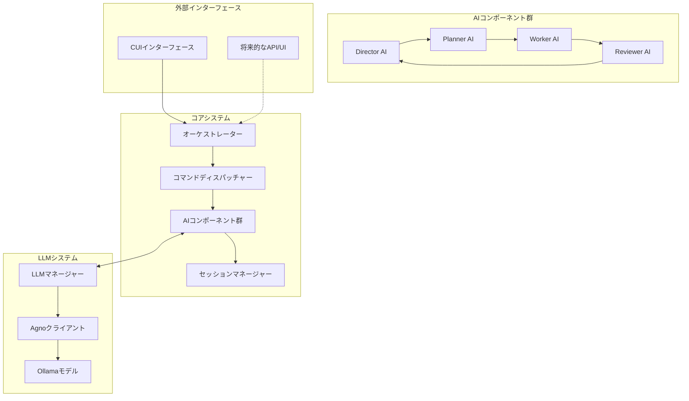
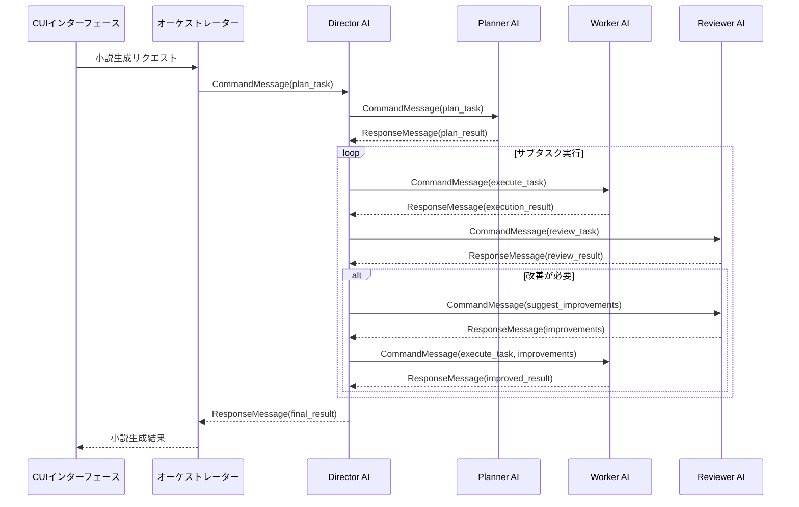

ARCHITECTURE

# AI小説生成オーケストレーションシステム - アーキテクチャ設計書

## 1. アーキテクチャ概要

### 1.1 システム全体像

AIオーケストレーションシステムは、複数のAIコンポーネントを連携させて長編小説を生成するための基盤です。システムは「分割して統治する」アプローチを採用しており、各専門AIが特定の役割を担います。



### 1.2 アーキテクチャの原則

1. **責務の明確な分離**: 各コンポーネントには明確に定義された責任領域があります
2. **疎結合と高凝集**: コンポーネント間の依存関係を最小限に抑え、関連機能をまとめます
3. **メッセージベース通信**: コンポーネント間の通信は標準化されたメッセージングで行います
4. **状態の一元管理**: セッションオブジェクトが状態を一元管理します
5. **拡張性と柔軟性**: 将来的な機能追加に対応できる設計

## 2. コンポーネント詳細

### 2.1 コアコンポーネント

#### オーケストレーター

システム全体の制御と調整を担当します。

```
FUNCTION ExecuteProcess(task_id, mode)
    // 入力: タスクID、実行モード
    // 出力: 実行結果

    // セッション取得または作成
    session = SessionManager.GetSession(session_id)
    
    // コマンドディスパッチャー作成
    dispatcher = CreateCommandDispatcher(session)
    
    // タスク計画フェーズ
    plan_result = dispatcher.execute_command(
        "plan_task", 
        task_id=task_id,
        mode=mode
    )
    
    // サブタスク実行フェーズ
    subtasks = plan_result.get("subtasks", [])
    results = []
    
    FOR EACH subtask IN subtasks
        execution_result = dispatcher.execute_command(
            "execute_task",
            task_id=subtask.id
        )
        
        // 評価フェーズ
        review_result = dispatcher.execute_command(
            "review_task",
            task_id=subtask.id,
            result=execution_result
        )
        
        // 改善が必要な場合
        IF review_result.score < 0.7 THEN
            improvements = dispatcher.execute_command(
                "suggest_improvements",
                review=review_result
            )
            
            // 改善を反映した再実行
            improved_result = dispatcher.execute_command(
                "execute_task",
                task_id=subtask.id,
                context={"improvements": improvements}
            )
            
            results.APPEND(improved_result)
        ELSE
            results.APPEND(execution_result)
        END IF
    END FOR
    
    // 結果統合フェーズ
    final_result = dispatcher.execute_command(
        "integrate_results",
        results=results
    )
    
    RETURN final_result
END FUNCTION
```

#### コマンドディスパッチャー

AIコンポーネントへのコマンド実行を担当します。コマンドパターンを実装しています。

```
FUNCTION ExecuteCommand(command_type, **kwargs)
    // 入力: コマンドタイプ、コマンドパラメータ
    // 出力: コマンド実行結果
    
    // コマンドクラスのマッピング
    command_map = {
        "plan_task": PlanTaskCommand,
        "execute_task": ExecuteTaskCommand,
        // その他のコマンド
    }
    
    // コマンドクラス取得
    IF command_type NOT IN command_map THEN
        RETURN {"error": "不明なコマンドタイプ", "status": "failure"}
    END IF
    
    command_class = command_map[command_type]
    
    // コマンドインスタンス作成と実行
    command = command_class(session=session, **kwargs)
    result = command.execute()
    
    RETURN result
END FUNCTION
```

#### セッションマネージャー

セッション状態の管理とストレージを担当します。

```
FUNCTION GetSession(session_id)
    // 入力: セッションID
    // 出力: セッションオブジェクト
    
    // メモリキャッシュをチェック
    IF session_id IN active_sessions THEN
        RETURN active_sessions[session_id]
    END IF
    
    // ストレージから読み込み
    session_data = LoadSessionFromStorage(session_id)
    IF session_data THEN
        session = CreateSessionFromData(session_data)
        active_sessions[session_id] = session
        RETURN session
    END IF
    
    // 存在しない場合は新規作成
    RETURN CreateNewSession(session_id)
END FUNCTION
```

### 2.2 AIコンポーネント

#### Director AI

全体のプロセス制御と最終的な統合を担当します。

```
FUNCTION ExecuteProcess(task_id)
    // 入力: メインタスクのID
    // 出力: 処理結果
    
    // タスク状態更新
    UpdateTaskStatus(task_id, EXECUTING)
    
    // Plannerで計画作成
    plan = planner.plan_task(task_id)
    
    // サブタスク実行
    execution_results = []
    FOR EACH subtask IN plan.subtasks
        // サブタスク実行
        result = worker.execute_task(subtask)
        
        // レビュー
        review = reviewer.review_task(subtask, result)
        
        // 必要に応じて改善
        IF review.score < threshold THEN
            improvements = reviewer.suggest_improvements(review)
            result = ReExecuteWithImprovements(subtask, improvements)
        END IF
        
        execution_results.APPEND(result)
    END FOR
    
    // 結果統合
    final_result = IntegrateResults(execution_results)
    
    // タスク状態更新
    UpdateTaskStatus(task_id, COMPLETED)
    
    RETURN final_result
END FUNCTION
```

#### Planner AI

小説の全体構造とサブタスクへの分解を担当します。

```
FUNCTION PlanTask(task, requirements)
    // 入力: タスク、要件リスト
    // 出力: 計画結果
    
    // タスクタイプの判定
    task_type = DetermineTaskType(task)
    
    // テンプレート選択と変数準備
    template_id = f"planner/{task_type}_planning"
    variables = {
        "task_id": task.id,
        "task_title": task.title,
        "task_description": task.description,
        "requirements": requirements,
        "session_context": GetSessionContext()
    }
    
    // LLMを使用した計画生成
    planning_content = llm_manager.generate_with_template(template_id, variables)
    
    // JSON解析と計画構造化
    parsed_plan = ParseJSONResponse(planning_content)
    
    plan_result = {
        "task_id": task.id,
        "subtasks": parsed_plan.get("subtasks", []),
        "dependencies": parsed_plan.get("dependencies", {}),
        "strategy": parsed_plan.get("strategy", "順次実行"),
        "metadata": parsed_plan.get("metadata", {})
    }
    
    RETURN plan_result
END FUNCTION
```

#### Worker AI

実際の小説コンテンツ生成を担当します。

```
FUNCTION ExecuteTask(task, context)
    // 入力: サブタスク、コンテキスト情報
    // 出力: 実行結果
    
    // タスクタイプ特定
    task_type = DetermineTaskType(task)
    
    // テンプレート選択
    template_id = f"worker/{task_type}_execution"
    
    // 変数準備
    variables = {
        "task_id": task.id,
        "task_title": task.title,
        "task_description": task.description,
        "requirements": task.requirements,
        "context": context
    }
    
    // コンテキスト情報の収集
    context_data = GatherContextData(task, context)
    IF context_data THEN
        variables["context_data"] = context_data
    END IF
    
    // LLMによる生成
    result_content = llm_manager.generate_with_template(template_id, variables)
    
    // 要件検証
    requirements_met = ValidateRequirements(result_content, task.requirements)
    
    // 結果構造化
    execution_result = {
        "task_id": task.id,
        "status": COMPLETED,
        "result": {
            "content": result_content,
            "requirements_met": requirements_met
        }
    }
    
    RETURN execution_result
END FUNCTION
```

#### Reviewer AI

生成コンテンツの評価とフィードバック提供を担当します。

```
FUNCTION ReviewTask(task, result)
    // 入力: タスク、実行結果
    // 出力: レビュー結果
    
    // タスクタイプ判定
    task_type = DetermineTaskType(task)
    template_id = f"reviewer/{task_type}_review"
    
    // 評価コンテキスト作成
    context = {
        "task_id": task.id,
        "task_title": task.title,
        "task_description": task.description,
        "requirements": task.requirements,
        "result_content": result.result.content
    }
    
    // LLMによるレビュー生成
    review_content = llm_manager.generate_with_template(template_id, context)
    
    // 評価メトリクス計算
    metrics = CalculateMetrics(task, result, review_content)
    suggestions = ExtractSuggestions(review_content)
    
    // レビュー結果構造化
    review_result = {
        "task_id": task.id,
        "status": "completed",
        "score": CalculateOverallScore(metrics),
        "feedback": review_content,
        "suggestions": suggestions,
        "metrics": metrics
    }
    
    RETURN review_result
END FUNCTION
```

### 2.3 LLM管理

#### LLMマネージャー

LLMとの通信と管理を担当します。

```
FUNCTION GenerateWithTemplate(template_id, variables)
    // 入力: テンプレートID、変数マップ
    // 出力: 生成されたテキスト
    
    // テンプレート読み込み
    template = LoadTemplate(template_id)
    IF NOT template THEN
        THROW TemplateNotFoundError
    END IF
    
    // テンプレートレンダリング
    prompt = template.render(**variables)
    
    // テキスト生成
    response = Generate(prompt)
    
    RETURN response
END FUNCTION

FUNCTION Generate(prompt)
    // 入力: プロンプト
    // 出力: 生成されたテキスト
    
    // モデルパラメータの準備
    merged_params = {
        **default_parameters,
        **current_parameters
    }
    
    // LLM呼び出し
    response = agno_client.run_query(prompt, **merged_params)
    
    RETURN response
END FUNCTION
```

#### AgnoClient

Agnoフレームワークとの連携を担当します。

```
FUNCTION RunQuery(query, images, **kwargs)
    // 入力: クエリテキスト、画像（オプション）、パラメータ
    // 出力: 生成されたテキスト
    
    // リトライロジック
    max_retries = 3
    retry_delay = 2  // 秒
    
    FOR attempt = 1 TO max_retries
        TRY
            // エージェントセットアップ（初回のみ）
            IF NOT setup_complete THEN
                SetupAgent()
            END IF
            
            // クエリ実行
            response = agent.run(query, images, **kwargs)
            RETURN response
        CATCH Exception AS e
            // エラーログ記録
            RecordError("run_error", e)
            
            // モデルロード中やタイムアウトの場合はリトライ
            IF ("loading model" IN e OR "timed out" IN e) AND attempt < max_retries THEN
                Sleep(retry_delay)
                retry_delay = retry_delay * 2  // 指数バックオフ
            ELSE IF attempt >= max_retries THEN
                RETURN "エラーが発生しました: " + e
            END IF
        END TRY
    END FOR
    
    RETURN "複数回の試行後もエラーが発生しました"
END FUNCTION
```

## 3. データフロー

### 3.1 コンポーネント間メッセージング

コンポーネント間の通信は、標準化されたメッセージングプロトコルを使用して行われます。



### 3.2 メッセージ構造

OrchestrationMessageは、コンポーネント間通信の標準フォーマットです。

```
TYPE OrchestrationMessage
    type: MessageType    // COMMAND, RESPONSE, ERROR, STATUS, FEEDBACK, QUERY
    sender: Component    // 送信元コンポーネント
    receiver: Component  // 宛先コンポーネント
    content: Dict        // メッセージ内容
    session_id: String   // セッションID
    action: String       // アクション名（オプション）
    timestamp: DateTime  // タイムスタンプ
END TYPE
```

## 4. 状態管理

### 4.1 セッション構造

セッションオブジェクトは、オーケストレーションの状態を保持します。

```
TYPE Session
    id: String             // セッションID
    title: String          // セッションタイトル
    mode: Mode             //